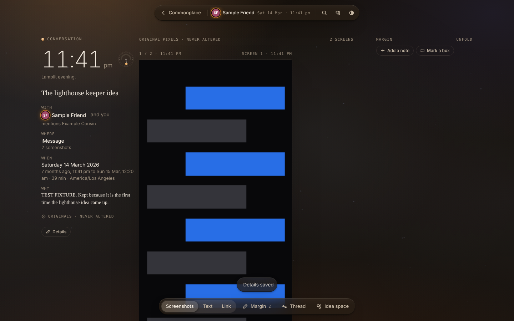
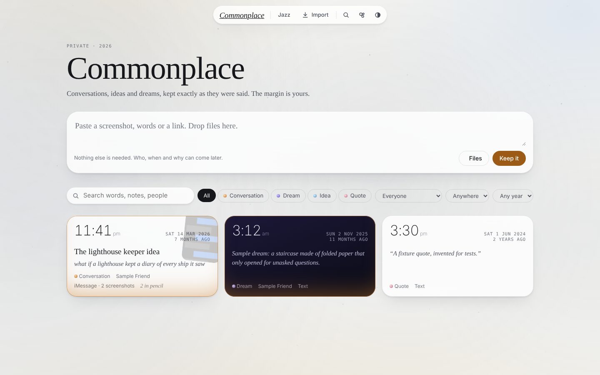
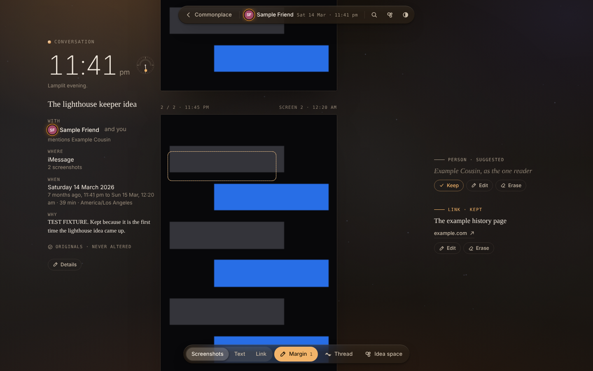
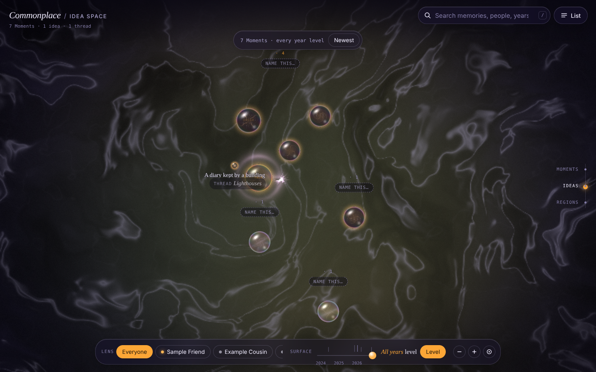
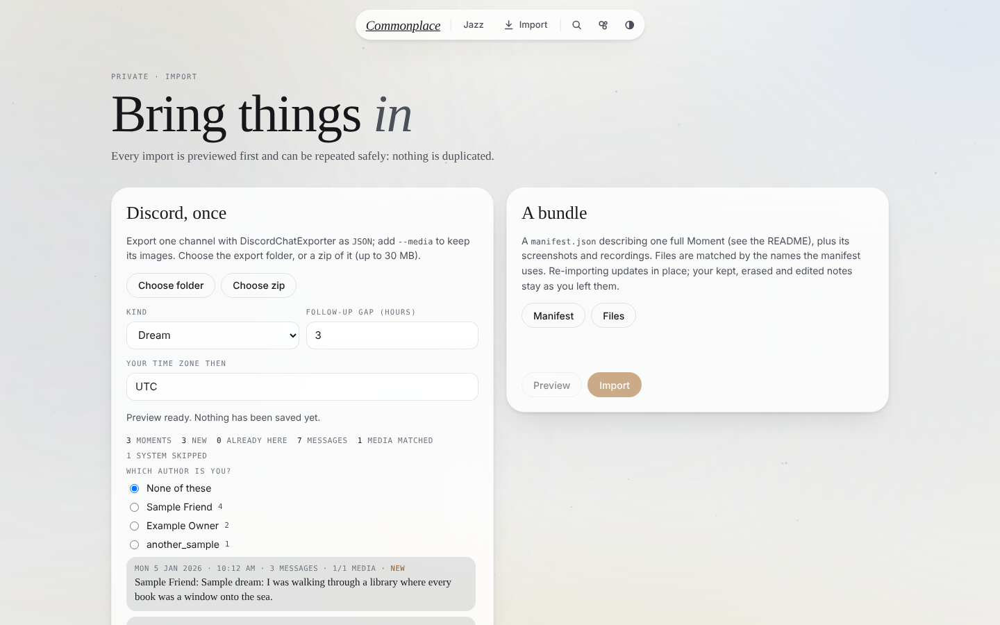
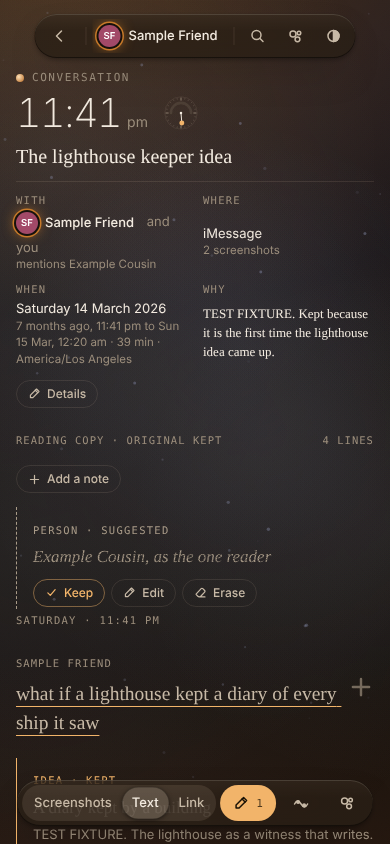
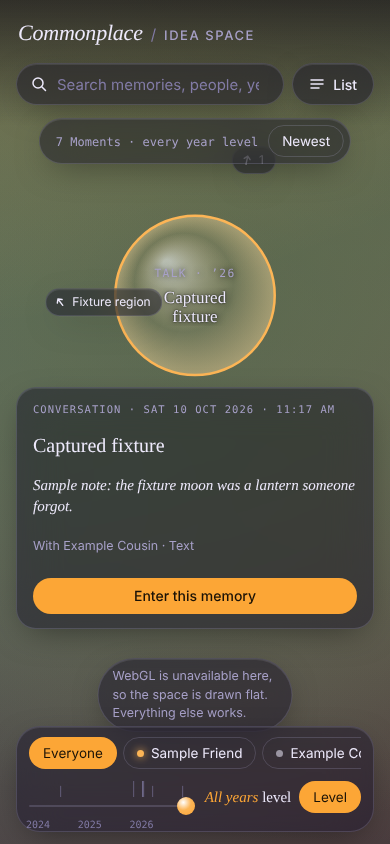

# Commonplace

`/commonplace/` is a private archive for one owner, behind the same Google
sign-in as `/jazz/`. Each saved item is a **Moment**: a conversation, a dream,
an idea or a quote.

- **Originals** (screenshots, verbatim text, voice memos, Discord messages,
  links) are stored exactly as received and never rewritten.
- **The margin** holds annotations, visibly separate from the original.
  Imported suggestions are written in *pencil* (grey italic with a graphite
  grain); the owner keeps them (they ink in), edits them (they become the
  owner's words, in ink) or erases them, each with Undo. The owner's own notes
  are written in ink.
- **Provenance** (who, where, when, and the hour in the time zone the owner was
  in) is always shown, on a museum-style wall label. **The hour lights the
  page**: 3 am is dark in every theme, 11:41 pm is lamplit, 7 am is cool dawn.
  Dreams are always shown in their own night light.

Everything in this repository is public, so every fixture, test and screenshot
uses invented sample data ("Sample Friend", "Example Cousin"). Real Moments are
loaded only through the API after deploy.



## Pages

| Route | What it is |
|---|---|
| `/commonplace/` | Index: capture, search, filters (kind, person, source, year), *On this day*, Moments newest first |
| `#m/<id>` | The Moment view: wall label with the hour and a 24-hour dial; Screenshots / Text / Link / Audio views of the original (switching keeps your place); the margin; the Thread strip; doorways |
| `#m/<id>?at=line:<id>` | Opens the Moment at a line (also `note:` and `artifact:`); used by search and thread knots |
| `#add?url=…&text=…&title=…` | The phone share-sheet route: keeps the shared link or words at once, then offers Details |
| `#space` | The Idea space (below); `#space?focus=<id>` rises out of that Moment's bubble |
| `#import` | Discord import (folder or zip, dry-run preview, then confirm) and bundle import |

Keyboard: `/` or `⌘K` search, `M` margin, `T` or `1`–`4` switch views, `I` Idea space.

**Capture.** Paste or drop a screenshot (it is kept instantly), pick files,
or paste words or a link. Nothing else is required; Details (title, kind, who
with which role, when and until in which time zone, where, why) can come later.

**The margin.** Folded by default: small ticks show where there is pencil.
`M` unfolds it. Notes sit beside the line or the box on the screenshot they
annotate (on phones, inline under it). *Add a note* writes in ink; the `+` on a
line anchors a note to it; *Mark a box* lets you drag a box on a screenshot.

**Special people.** `PATCH /v1/commonplace/people/{id}` with
`{"special": true}` gives a person a warm signature: a warm ring on their
avatar, a warm light in their Moments and warm bubbles in the Idea space. It is
a per-person flag set by the owner, never a name in code.

### The Idea space

A Pensieve basin seen from above (raw WebGL2: a domain-warped fluid, thread
currents and instanced glass bubbles; a flat Canvas2D fallback when WebGL2 is
missing, forced with `#space?flat=1`). Every bubble comes from
`GET /v1/commonplace/space`: Moments, Ideas (margin notes of type `idea`, which
orbit their Moment) and Threads (currents from the oldest knot to the newest).

- **Layout** is computed in the browser (`assets/commonplace/space-model.js`),
  deterministic and stable: Moments are grouped into regions by their main
  person, else their thread, else their kind. Region positions come from a hash
  of the region's key, Moments sit on a sunflower spiral (oldest at the centre)
  and a grid-based relaxation keeps bubbles apart. It looks right with one
  Moment and scales to thousands.
- **The owner names things.** Regions and threads are nameless until named:
  an unnamed region shows only its count and *Name this…*, which stores the
  name with `PUT /v1/commonplace/regions/{key}` (keys like `person:<id>`,
  `thread:<id>`, `kind:dream`). An unnamed thread is named from its follow bar.
- **Time** opens *Level* (every year at the same depth); the year slider is an
  optional control that brings one year to the surface.
- **Phones** open on the most recent memory; desktops on the whole map.
- Dreams are night bubbles with slow stars; a special person's Moments glow warm.
- Lenses by person, search, thread follow (‹ ›), a full **List** alternative
  (`L`), spatial keyboard navigation (arrows, `+`/`-`, `0`, Enter, Escape) and
  reduced motion. Opening a Moment dives into its bubble and ends in that
  Moment's view.

## API

All routes are under `/v1/commonplace` (served at `/commonplace/api/v1/commonplace`
through Caddy), require the gateway key and verified user like the Jazz API, and
send `Cache-Control: private, no-store`, `X-Robots-Tag: noindex` and
`Referrer-Policy: no-referrer`. Writes must be same-site and use a body type
that needs a CORS preflight: JSON, raw media for artifact uploads, or
`multipart/form-data` **with the header `X-Commonplace-Upload: 1`** for imports.

| Method and path | Purpose |
|---|---|
| `GET /moments?kind=&person=&source=&year=&limit=&offset=` | List, newest first, with excerpt, counts and cover |
| `POST /moments` | Capture `{clientCaptureId, text?, url?, linkTitle?, kind?, title?, why?, occurredAt?, timezone?, source?, sourceDetail?}`; idempotent on `clientCaptureId` (201, then 200 with the original) |
| `GET /moments/{id}` | The full Moment: artifacts, lines, annotations, threads with knots, doorways |
| `PATCH /moments/{id}` | `{expectedRevision, kind?, title?, why?, occurredAt?, endedAt?, timezone?, source?, sourceDetail?, people?: [{id or name, role}]}`; 409 with the current Moment on a stale revision |
| `DELETE /moments/{id}` | Deletes the Moment and its stored files |
| `POST /moments/{id}/artifacts` | Raw image or audio body (validated like inspiration images); headers `X-File-Name`, `X-Image-Width/Height` (WebP), `X-Duration-Ms` |
| `DELETE /artifacts/{id}` | Removes one artifact |
| `GET /media/{artifactId}` | 302 to a 10-minute signed URL in the private bucket |
| `POST /moments/{id}/lines`, `PATCH /lines/{id}`, `DELETE /lines/{id}` | Transcript lines (PATCH needs `expectedRevision`) |
| `POST /moments/{id}/annotations` | An owner note in ink, anchored to `lineId`, or `artifactId` + `rect`, with optional `linkUrl` / `linkMomentId` |
| `PATCH /annotations/{id}` | `{expectedRevision, state?: pencil/ink/erased, title?, body?, …}`; editing the words inks the note; re-imports never overwrite it afterwards |
| `GET /people`, `POST /people`, `PATCH /people/{id}` | Names, aliases and the `special` flag |
| `GET /threads`, `POST /threads`, `GET/PATCH /threads/{id}`, `POST /threads/{id}/knots`, `DELETE /knots/{id}` | Threads and their knots (`fire` or `plain`) |
| `GET /search?q=` | Ranked hits grouped by Moment, with snippets (matches marked U+E000…U+E001) and anchors |
| `GET /on-this-day?today=YYYY-MM-DD` | Earlier years' Moments on this month and day, in each Moment's zone |
| `GET /space`, `PUT /regions/{key}` | Idea-space data and region names |
| `POST /import/bundle` | Bundle import (below) |
| `POST /import/discord` | Discord import (below) |

Full-text search covers lines, titles, the owner's why, the source detail,
annotations (not erased ones), text artifacts, link titles and captured link
text, plus people's names and aliases. It uses prefix matching, so `lightho`
finds *lighthouse*.

## Bundle import

`POST /v1/commonplace/import/bundle` takes `multipart/form-data` (with
`X-Commonplace-Upload: 1`):

- a part named **`manifest`**: the JSON below (as a field or a file);
- one part per image or audio file. A file is matched to its artifact by the
  **form field name** given in the artifact's `file` (or its `key` when `file`
  is omitted), and failing that by its **file name** (folders ignored);
- optionally `dryRun=1`: everything is validated and the report returned, and
  nothing is written or uploaded.

It is **idempotent on `externalKey`**: importing the same key again updates the
Moment in place and never duplicates it.

- Artifacts, lines and annotations are matched by their `key`. Ones removed
  from the manifest are removed, except what the owner added in the app
  (uploads and lines added there are kept).
- An image or audio artifact whose file is not in this request keeps its stored
  file. If it has none yet it is created as *waiting for its file* and listed in
  `missingFiles`, so a large bundle can be sent in several requests, each with
  the same manifest and some of the files. Cloud Run limits one request to
  32 MB; the import page batches automatically.
- A changed file (different SHA-256) replaces the stored one; the old object is
  deleted after the import commits.
- Annotations are imported in `pencil` (or `ink` when marked). Once the owner
  keeps, erases or edits a note, re-imports never change it.
- Threads are matched by `key` across bundles. Each bundle owns the knots it
  imported, so two bundles can add knots to one thread.
- **People keys are global**: use the same `key` for the same person in every
  bundle. A new key is matched to an existing person by name or alias first.

The response reports `momentId`, `created`, `counts`, `filesStored`,
`filesKept`, `missingFiles`, `unusedFiles`, `removed` and `warnings`. A
manifest with problems is rejected (422) with every problem listed by path,
for example `lines[3].speaker "frend" must be "me" or a key from people`.
Unknown fields are rejected too, so typos do not pass silently.

### Manifest format (version 1)

```jsonc
{
  "version": 1,
  "externalKey": "sample:2026-03-14-lighthouse",   // required; stable, unique per Moment
  "moment": {
    "kind": "conversation",            // conversation | dream | idea | quote
    "title": "The lighthouse keeper idea",
    "why": "Kept because it is the first time the lighthouse idea came up.",
    "occurredAt": "2026-03-14T23:41:00-07:00",   // RFC 3339 with an offset
    "endedAt": "2026-03-15T00:20:00-07:00",
    "timezone": "America/Los_Angeles",           // IANA zone the owner was in
    "source": "imessage",              // imessage | discord | voice | text | link | other
    "sourceDetail": "2 screenshots"    // free text: a channel, a place
  },
  "people": [
    // role: sender | recipient | mentioned (or "roles": [...]); "special": true for the warm signature
    { "key": "sample-friend", "name": "Sample Friend", "aliases": ["SF"], "role": "sender" },
    { "key": "example-cousin", "name": "Example Cousin", "role": "mentioned" }
  ],
  "artifacts": [                       // shown in this order
    { "key": "shot-1", "kind": "image", "file": "shot1", "caption": "Screen 1", "alt": "A message thread about a lighthouse" },
    { "key": "shot-2", "kind": "image", "file": "shot2" },
    { "key": "memo", "kind": "audio", "file": "memo", "durationMs": 61000 },
    { "key": "note", "kind": "text", "text": "Verbatim text, kept exactly." },
    { "key": "page", "kind": "link", "url": "https://example.com/lighthouses",
      "title": "A short history of lighthouses", "siteName": "example.com",
      "capturedText": "The page text as captured.", "capturedAt": "2026-03-15T00:05:00-07:00" }
  ],
  "lines": [                           // the reading copy, in order; text is verbatim
    { "key": "l1", "speaker": "sample-friend", "text": "what if a lighthouse kept a diary of every ship it saw",
      "at": "2026-03-14T23:41:00-07:00", "dayLabel": "Saturday", "timeLabel": "11:41 PM",
      "artifact": "shot-1", "rect": [4.8, 21.0, 65.0, 9.5] },   // where on the screenshot: x, y, w, h in percent
    { "key": "l2", "speaker": "me", "text": "and nobody ever read it",
      "meta": { "edited": true, "reactions": [{ "emoji": "❤️", "count": 1 }] } },
    { "key": "l3", "speaker": "sample-friend", "text": "Example Cousin would read it. twice.",
      "meta": { "replyTo": "l2", "replies": 1, "note": "first line cut off on the screenshot" } }
  ],
  "annotations": [
    { "key": "n1", "state": "pencil", "type": "idea", "title": "A diary kept by a building",
      "body": "The lighthouse as a witness that writes.", "anchor": { "line": "l1" } },
    { "key": "n2", "type": "person", "title": "Example Cousin, as the one reader",
      "anchor": { "artifact": "shot-2", "rect": [4.8, 10.0, 60.0, 7.0] } },
    { "key": "n3", "state": "ink", "type": "link", "title": "The history page",
      "anchor": { "line": "l3" }, "link": { "url": "https://example.com/lighthouses", "label": "example.com" } },
    { "key": "n4", "type": "echo", "title": "The same image, a year later",
      "link": { "moment": "sample:2027-03-01-lighthouse-again", "label": "A year later" } }
  ],
  "threads": [
    { "key": "sample-lighthouse", "title": "Lighthouses", "knots": [
      { "moment": "self", "line": "l1", "label": "the diary", "style": "fire" },   // "self" (or omitted) = this Moment
      { "line": "l2", "label": "nobody reads it" },
      { "moment": "sample:2025-08-02-harbour", "label": "the harbour" }          // another Moment by externalKey
    ] }
  ]
}
```

Notes:

- `speaker` is `"me"` (the owner), a key from `people`, or empty (unknown); an
  unknown speaker can carry `speakerLabel`.
- `meta` is a free JSON object (up to 8 KB). The Moment view shows `edited`,
  `pinned`, `replies` (a number or text), `reactions` (`[{emoji, count}]` or
  strings), `replyTo` (a line key) and `note`.
- `rect` is `[x, y, width, height]` in percent of the image (0–100); a line's
  rect needs its `artifact`, an annotation's needs `anchor.artifact`.
- Annotation `type` is a short lowercase word (`note`, `idea`, `person`,
  `quote`, `link`, `care`, …). Ideas also appear in the Idea space.
- Links to Moments that are not imported yet are reported in `warnings`;
  re-import the bundle afterwards to connect them.
- Image files: JPEG, PNG, WebP or GIF up to 20 MB (give `width` and `height`
  for WebP). Audio: MP3, M4A/AAC, WAV, WebM or Ogg up to 30 MB.

Example with curl through a signed-in session is impractical (the cookie is
HttpOnly); use the import page, or send it to the Cloud Run URL with the
gateway key from a trusted machine:

```sh
curl -sS "$JAZZ_API_URL/v1/commonplace/import/bundle" \
  -H "X-Jazz-Gateway-Key: $JAZZ_GATEWAY_KEY" -H "X-Jazz-User: $JAZZ_USER" \
  -H "X-Commonplace-Upload: 1" \
  -F manifest=@manifest.json -F shot1=@screen-1.png -F shot2=@screen-2.png
```

A complete fictional manifest is in
[`jazz-api/testdata/commonplace/bundle-sample.json`](../../jazz-api/testdata/commonplace/bundle-sample.json).

## Discord import

`POST /v1/commonplace/import/discord` takes a
[DiscordChatExporter](https://github.com/Tyrrrz/DiscordChatExporter) **JSON**
export of one channel. Export with `--media` (and optionally `--reuse-media`)
to download attachments: their `url` then becomes a relative path such as
`dreams.json_Files/image-1A2B3.png`.

Multipart parts: `export` (the JSON file) and `media` files (the file name is
the path relative to the export folder), **or** `archive` (a zip of the export
folder, up to 30 MB). Fields: `kind` (default `conversation`; the page suggests
`dream` for channels named like *dreams*), `gapHours` (default 3), `timezone`,
`me` (the owner's Discord author id, whose messages become *you*),
`channelLabel`, `dryRun=1`, and `mediaManifest` (a JSON list of media paths the
browser holds but did not send, so a preview can count matches).

- Messages used: types `Default`, `Reply` and `ThreadStarterMessage` with
  words or attachments; joins, pins and calls are skipped.
- **Grouping:** each top-level post starts a Moment. A reply joins the Moment of
  the message it replies to. Any other message within `gapHours` of the
  Moment's last message is a follow-up and joins it, unless it is a long
  standalone post (280+ characters) by someone other than the Moment's first
  author, which starts its own Moment.
- Each message becomes a verbatim line with its time, author, `edited`,
  `pinned`, `replyTo` and reactions. Image and audio attachments become
  artifacts (other files are skipped); the first image anchors the line.
- **People** come from authors (`discord:<id>`), with their name and nickname
  as aliases; an author already known by name or alias is reused.
- **Idempotent on message ids**: a message is never imported twice, even with a
  different gap. A re-import refreshes reactions and edits, and fills in media
  that was missing. Media can arrive in later batches.
- The response is a preview: `groups` (start, starter, excerpt, counts,
  whether it already exists), `authors`, and `totals`. With `dryRun=1` nothing
  is written.

The import page reads a chosen folder (`webkitdirectory`) or zip, previews the
grouping and lets you mark which author is you, then uploads the export with
the media in batches of at most 16 MB.

A fictional export is in
[`jazz-api/testdata/commonplace/discord-dreams.json`](../../jazz-api/testdata/commonplace/discord-dreams.json).

## Storage and data model

Migration `027_commonplace.sql` (replay-safe) adds `cp_people`, `cp_moments`,
`cp_moment_people`, `cp_artifacts`, `cp_lines`, `cp_annotations`,
`cp_threads`, `cp_thread_knots` and `cp_regions`. Lines, annotations,
artifacts and Moments each carry a generated `tsvector` with a GIN index.
Images and audio go to the private recording bucket under
`commonplace/<user>/<moment>/<artifact>-<sha>.<ext>` with their type, size,
SHA-256 and dimensions; the browser only ever sees short-lived signed URLs.

## Tests

```sh
cd jazz-api && go vet ./... && TRUMPETS_TEST_DATABASE_URL=postgres://… go test ./...
node --test assets/commonplace/*.test.js
python -m unittest discover -s tools/commonplace -p 'test_*.py'
npm install --no-save --package-lock=false playwright@1.58.2
TRUMPETS_TEST_DATABASE_URL=postgres://… node tools/commonplace/browser-check.cjs
```

The Go tests run every migration twice and cover capture idempotency, the
margin's states and revisions, bundle import and re-import (including partial
files and owner decisions surviving), Discord grouping, idempotency and media,
search, the space payload and authentication. The browser check starts an
isolated preview (`TestCommonplaceBrowserPreview`, loopback only, media in
memory), seeds fictional data and checks capture, the Moment view, margin
keep/erase/undo, an owner note, the thread and doorways, search, the Discord
import preview and confirm, and the Idea space (WebGL2 and the flat fallback)
at 390 px and 1440 px, failing on any runtime error. Screenshots land in
`docs/commonplace/screenshots/`.

| | |
|---|---|
|  |  |
|  |  |
|  |  |

## Deploy

1. **Merge the PR.** The deploy workflow deploys the API to Cloud Run; startup
   applies migration `027_commonplace.sql` (replay-safe, so restarts are safe).
   It then publishes the static release, which now includes `commonplace/`
   (`publish-static-release.sh` refuses a release without
   `commonplace/index.html`).
2. **Add the API route once** on the site VM (`/commonplace` pages are already
   private; only the API route is new):

   ```sh
   flags=(--project actual-budget-zb --zone us-west1-a --tunnel-through-iap)
   gcloud compute scp "${flags[@]}" deploy/install-commonplace-route.py deploy/verify-jazz-auth.py actual-server:/tmp/
   gcloud compute ssh actual-server "${flags[@]}" --command \
     "sudo python3 /tmp/install-commonplace-route.py --dry-run && sudo python3 /tmp/install-commonplace-route.py"
   ```

   It keeps the Caddyfile's owner, group and mode, validates the candidate with
   `caddy validate` (using `/etc/caddy/jazz.env`), reloads Caddy and runs
   `verify-jazz-auth.py` (which now also checks that `/commonplace/` and
   `/commonplace/api/…` require sign-in and refuse cross-site writes), and rolls
   back automatically if anything fails. Re-running only verifies.
3. **Load real Moments** through the import page (bundle or Discord), signed in.
